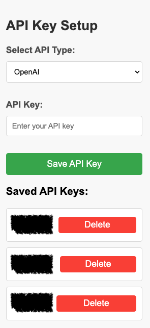
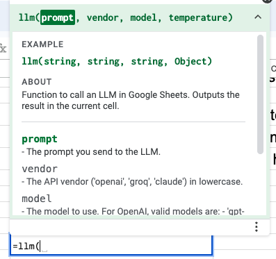

# Quick Start

Get started in 4 easy steps:

1. Install Llama for Sheets from the as a Google Sheets Add on.
2. From the sheets menu, select Extensions→Llama for Sheets→API Key Setup. Enter your keys.

<figure><figcaption>
We will never store any of your keys on our severs. The keys are yours!
</figcaption></figure>

3. From the sheets menu, select Extensions→Llama for Sheets→Cheetsheet. This is a convenience page to show the supported vendors and models. At the time of this screenshot, Claude, Groq, Openai are supported. This will be updated all the time.

<figure><figcaption>
At the time of writing this, Llama 3.1 support just came out. 
</figcaption></figure>

4. Now you are good to go. Type in =llm(

<figure><figcaption>
easiest to reference the vendor and model from the cheatsheet
</figcaption></figure>

Questions: email me at info@llamaforsheets.com
